# PillPal - Mobile Application

If you see this Have a good day my friend - ChienNH

  

  
  
  
  
  
  

  
Click to expand

- [Introduction](#introduction)
- [Mobile Application Design](#mobile-application-design)
- [Feature](#feature)
- [Screen Overview](#screen-overview)
- [Contributors](#contributors)

## Introduction

Mobile application for PillPal project. Built with Flutter and incorporates Firebase services as Firestore Storage, Authentication, and Cloud Messaging. The application mainly assists users in searching and creating medication intake schedules from scanned prescriptions using OCR technology.

<a href="#top">[back to top]</a>

## Mobile Application Design

  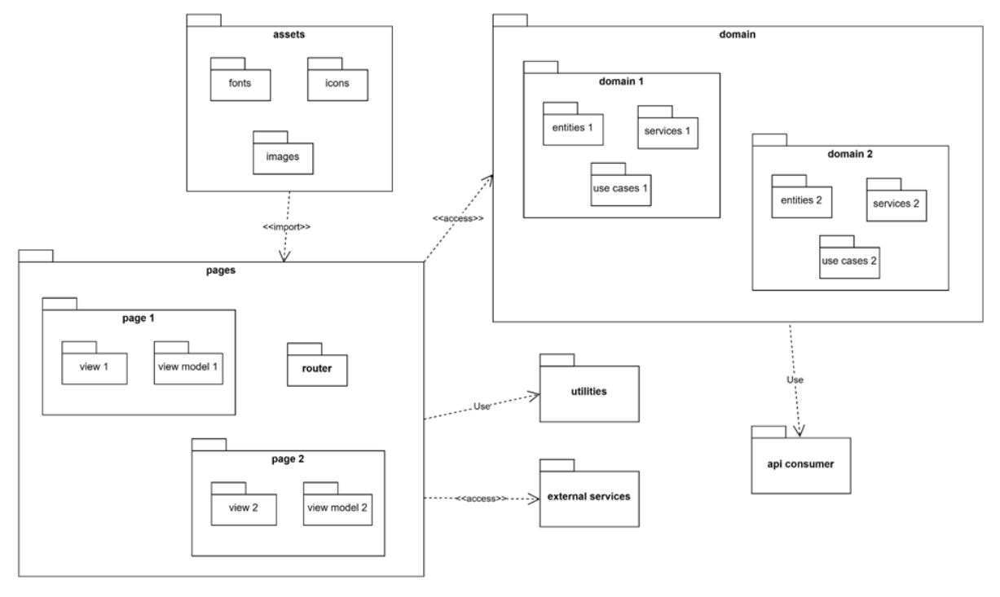
  
Mobile Package Design

<a href="#top">[back to top]</a>

## Feature

The mobile application provides the following features:

- User Authentication with Google Account
- Manage User Profile and Meal Time
- Search for Medicine Information
- Compare Medicine Prices
- Find Nearby Pharmacies
- Manual add Medicine Prescription, Intake Schedule
- Scan and create Prescription, Intake Schedule
- Integrate third-party payment gateway (ZaloPay)

<a href="#top">[back to top]</a>

## Screen Overview

  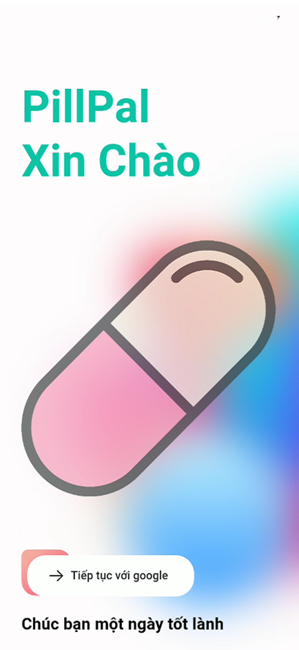
  
Login/Register Screen

 

  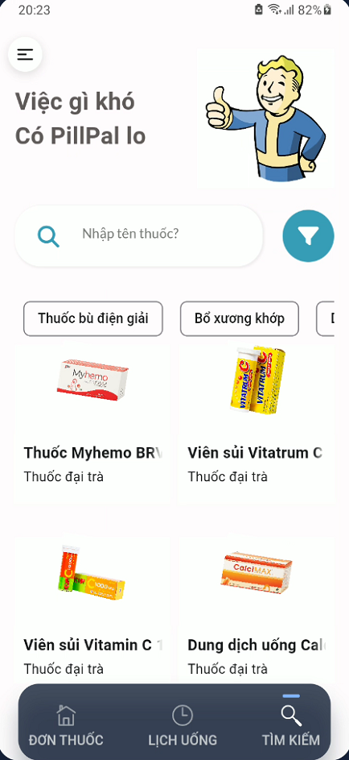
  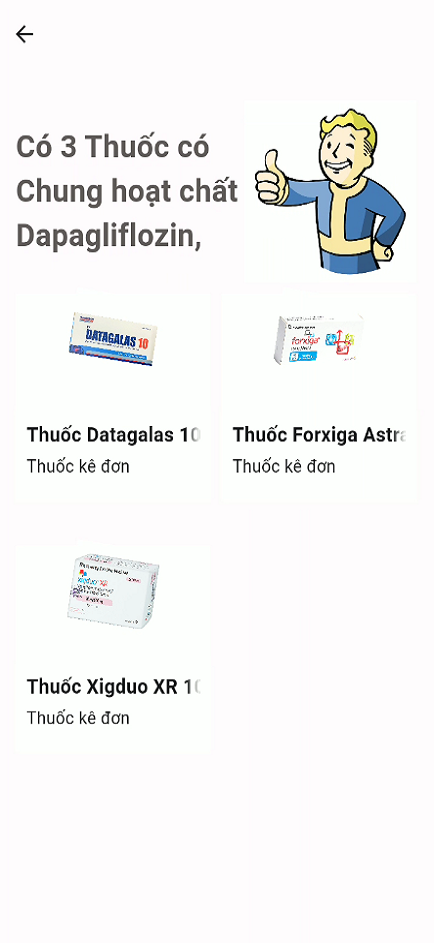
  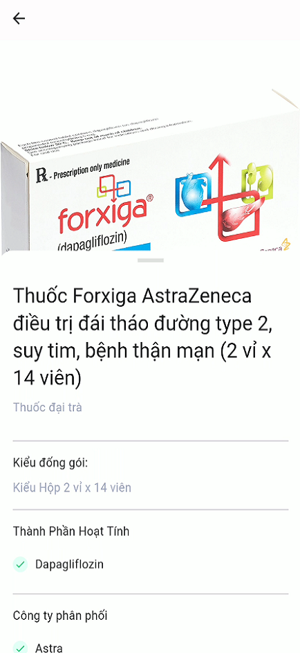
  
Medicine Search Screen

 

  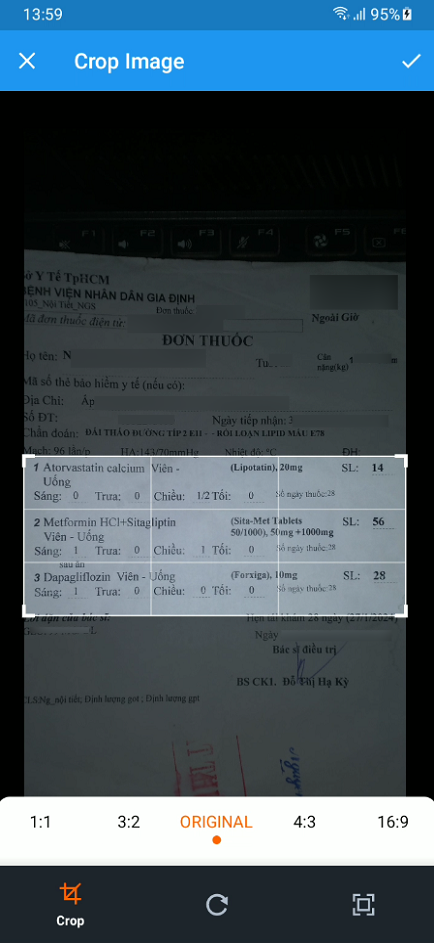
  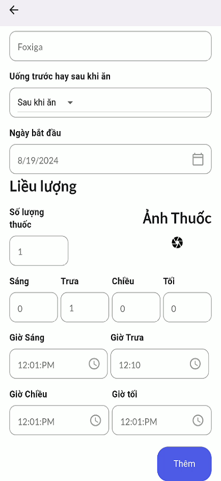
  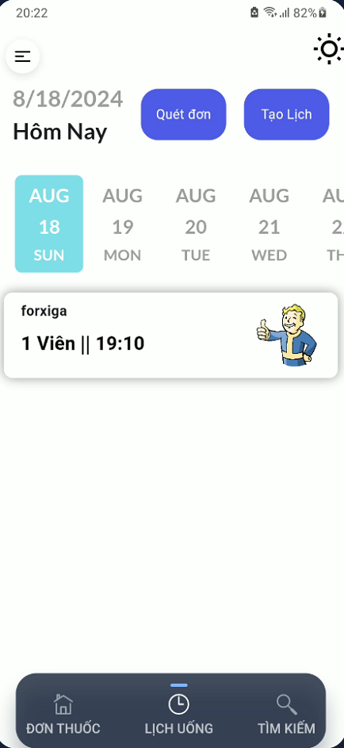
  
Medicine Prescription Screen

 

  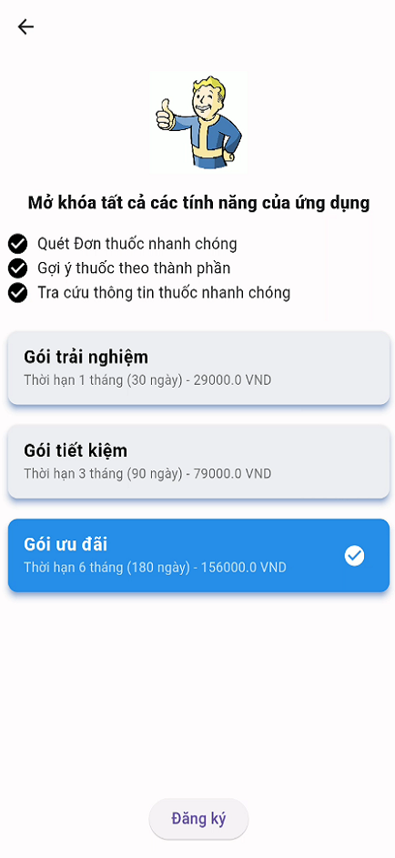
  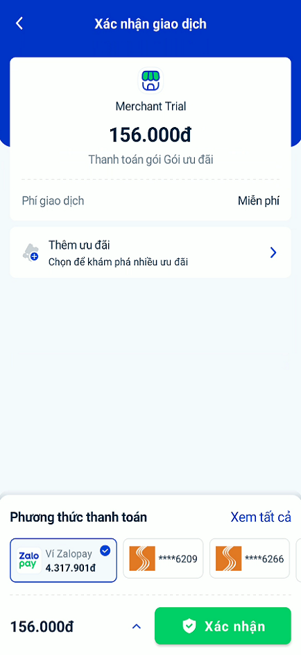
  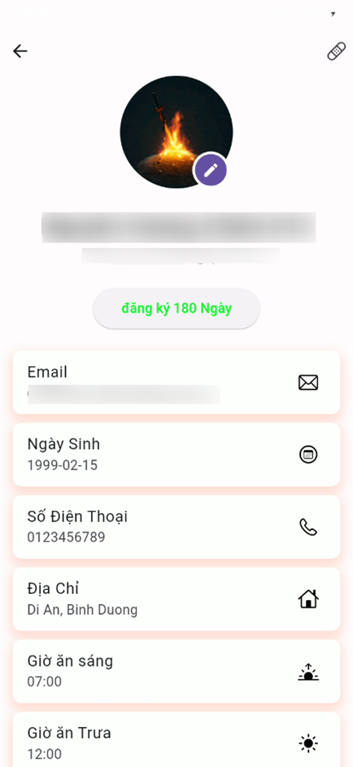
  
Medicine Purchase Screen

<a href="#top">[back to top]</a>

## Contributors

<a href="#top">[back to top]</a>

